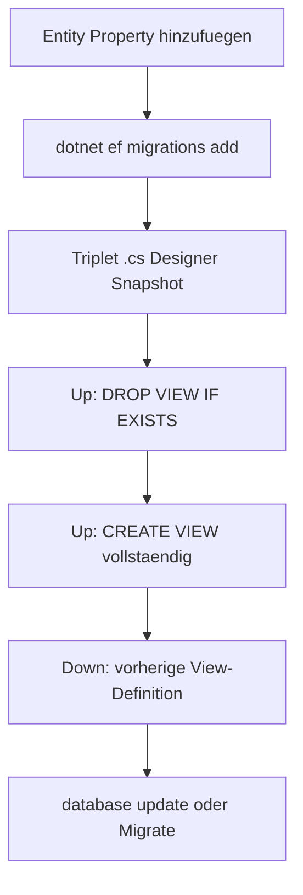

# View-Migrationen — SQL-Muster und Down-Symmetrie

EF Core verwaltet Views nicht automatisch. Die View ist im DbContext als keyless Entity gemappt:

- Entity: `{backend-path}/{database-project}/Entities/{ViewEntity}.cs`
- Mapping: `modelBuilder.Entity<{ViewEntity}>().ToView("{view-name}").HasNoKey();`

## Ablauf



1. **Entity zuerst** — neue Property am `{ViewEntity}` (Typ passend zur SELECT-Spalte).
2. **`dotnet ef migrations add`** — erzeugt Triplet; `Up()`/`Down()` sind oft leer oder unzureichend.
3. **SQL in die generierte `.cs` einfügen** (nicht eine zweite handgeschriebene Migrationsdatei anlegen).

## SQL-Muster in `Up()`

Kanon aus vorhandener View-Migration (projektspezifischen letzten Stand als Vorlage nehmen):

```csharp
migrationBuilder.Sql("DROP VIEW IF EXISTS {view-name};");
migrationBuilder.Sql(@"
CREATE VIEW {view-name} AS
SELECT
    ...
    s.""MachineId""                        AS ""Machine"",
    s.""LaserId""                          AS ""Laser"",
    ...
FROM parameter_sets ps
JOIN experiment_tasks et ON ...
JOIN setups s ON ...
JOIN results r ON ...
");
```

**Regeln:**

- Postgres: doppelte Anführungszeichen für Identifier (`""Machine""`).
- Immer **vollständige** `CREATE VIEW`-Liste — nicht nur die neue Spalte ergänzen (View wird ersetzt, nicht `ALTER VIEW` add column).
- `DROP VIEW IF EXISTS` vor `CREATE` in `Up()`.

## `Down()`

`Down()` muss die **vorherige** View-Definition wiederherstellen (aus der letzten Migration kopieren und anpassen). Symmetrie verhindert kaputte Rollbacks auf Dev-DBs.

Referenz: letzte View-Migration im Migrations-Ordner als Vorlage verwenden.

## Was editieren vs. was nicht

| Erlaubt | Verboten |
|---------|----------|
| SQL in CLI-generierter `{Name}.cs` nach `migrations add` | Neues Migrations-Paar komplett von Hand ohne CLI |
| Entity + Search-Service-Spalten konsistent halten | Nur Snapshot ändern |
| Designer + Snapshot durch CLI erzeugt lassen | Nur `.cs` mit selbst gewähltem Timestamp |

## Nach der Migration

- `SearchService` / `setupColumns`: neue Spalte in Server-Filter und Spaltenlisten prüfen (separater Code-Task, aber gleiche Story).
- Verifikation: Spalte in DB + API ohne `42703` — siehe [artifact-checklist.md](artifact-checklist.md).

## Postgres-Hinweise

- `jsonb`-Spalten in `Parameters`/`Materials` unverändert lassen, wenn nicht Teil der Änderung.
- `COALESCE` in Result-Spalten wie in bestehenden View-Migrationen beibehalten.
- Keine Secrets in SQL-Kommentaren.
