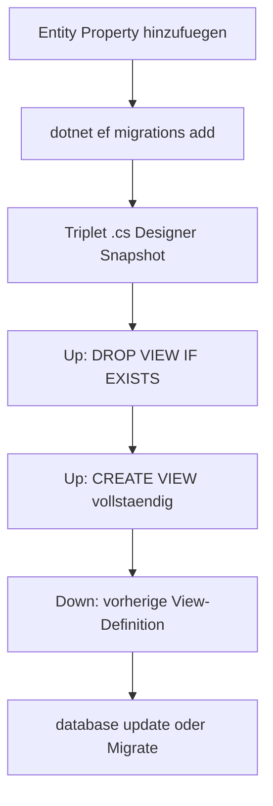

# View-Migrationen — SQL-Muster und Down-Symmetrie

EF Core verwaltet Views nicht automatisch. Die View ist im DbContext als keyless Entity gemappt:

- Entity: `{backend-path}/{database-project}/Entities/{ViewEntity}.cs`
- Mapping: `modelBuilder.Entity<{ViewEntity}>().ToView("{view-name}").HasNoKey();`

## Ablauf



1. **Entity zuerst** — neue Property am `{ViewEntity}` (Typ passend zur SELECT-Spalte).
2. **`dotnet ef migrations add`** — erzeugt Triplet; `Up()`/`Down()` sind oft leer oder unzureichend.
3. **SQL in die generierte `.cs` einfügen** (nicht eine zweite handgeschriebene Migrationsdatei anlegen).

## SQL-Muster in `Up()`

**Vorlage-Quelle:** immer die tatsächlich letzte View-Migration im `Migrations`-Ordner (per Timestamp/`ls` verifiziert), **niemals** ein Plan-/Brief-/Spec-Dokument — solche Dokumente werden oft vor einer späteren, unabhängigen View-Änderung geschrieben und sind dann selbst veraltet. Vor dem Schreiben der neuen `Up()`: SELECT-Spaltenliste der neuen Migration Spalte-für-Spalte gegen die Vorlage diffen, nicht nur "sieht ähnlich aus" prüfen. Ein 2026-08-10 tatsächlich passierter Fall: eine Migration wurde aus einer älteren Vorlage kopiert und entfernte dabei stillschweigend eine Spalte + einen `WHERE`-Filter, die eine spätere Migration bereits hinzugefügt hatte — Backend-Tests liefen weiter grün (sie laufen gegen einen In-Memory-Testcontext, nicht gegen die echte SQL-View), der Fehler zeigte sich erst zur Laufzeit gegen Postgres.

Kanon aus vorhandener View-Migration (projektspezifischen letzten Stand als Vorlage nehmen):

```csharp
migrationBuilder.Sql("DROP VIEW IF EXISTS {view-name};");
migrationBuilder.Sql(@"
CREATE VIEW {view-name} AS
SELECT
    ...
    s.""MachineId""                        AS ""Machine"",
    s.""LaserId""                          AS ""Laser"",
    ...
FROM parameter_sets ps
JOIN experiment_tasks et ON ...
JOIN setups s ON ...
JOIN results r ON ...
");
```

**Regeln:**

- Postgres: doppelte Anführungszeichen für Identifier (`""Machine""`).
- Immer **vollständige** `CREATE VIEW`-Liste — nicht nur die neue Spalte ergänzen (View wird ersetzt, nicht `ALTER VIEW` add column).
- `DROP VIEW IF EXISTS` vor `CREATE` in `Up()`.

## `Down()`

`Down()` muss die **vorherige** View-Definition wiederherstellen (aus der letzten Migration kopieren und anpassen). Symmetrie verhindert kaputte Rollbacks auf Dev-DBs.

Referenz: letzte View-Migration im Migrations-Ordner als Vorlage verwenden.

## Was editieren vs. was nicht

| Erlaubt | Verboten |
|---------|----------|
| SQL in CLI-generierter `{Name}.cs` nach `migrations add` | Neues Migrations-Paar komplett von Hand ohne CLI |
| Entity + Search-Service-Spalten konsistent halten | Nur Snapshot ändern |
| Designer + Snapshot durch CLI erzeugt lassen | Nur `.cs` mit selbst gewähltem Timestamp |

## Fehlerhafte, bereits angewendete Migration reparieren

Reicht **nicht**: nur die `.cs`-Datei der fehlerhaften Migration nachträglich korrigieren.
EF Core merkt sich angewendete Migrationen per Name in `__EFMigrationsHistory` und führt
eine bereits verzeichnete Migration nicht erneut aus — der Code-Edit hat auf eine DB, die
diese Migration schon angewendet hat, keine Wirkung.

Richtig: **neue** Migration erstellen, deren `Up()` die korrekte View-Definition erneut
anlegt. `Down()` dieser neuen Migration stellt den tatsächlichen (fehlerhaften) Vorzustand
wieder her — nicht einen "guten" Zustand, der so nie in der DB existierte — damit die
Migrationshistorie konsistent bleibt.

## Nach der Migration

- `SearchService` / `setupColumns`: neue Spalte in Server-Filter und Spaltenlisten prüfen (separater Code-Task, aber gleiche Story).
- Verifikation: Spalte in DB + API ohne `42703` — siehe [artifact-checklist.md](artifact-checklist.md).

## Postgres-Hinweise

- `jsonb`-Spalten in `Parameters`/`Materials` unverändert lassen, wenn nicht Teil der Änderung.
- `COALESCE` in Result-Spalten wie in bestehenden View-Migrationen beibehalten.
- Keine Secrets in SQL-Kommentaren.
