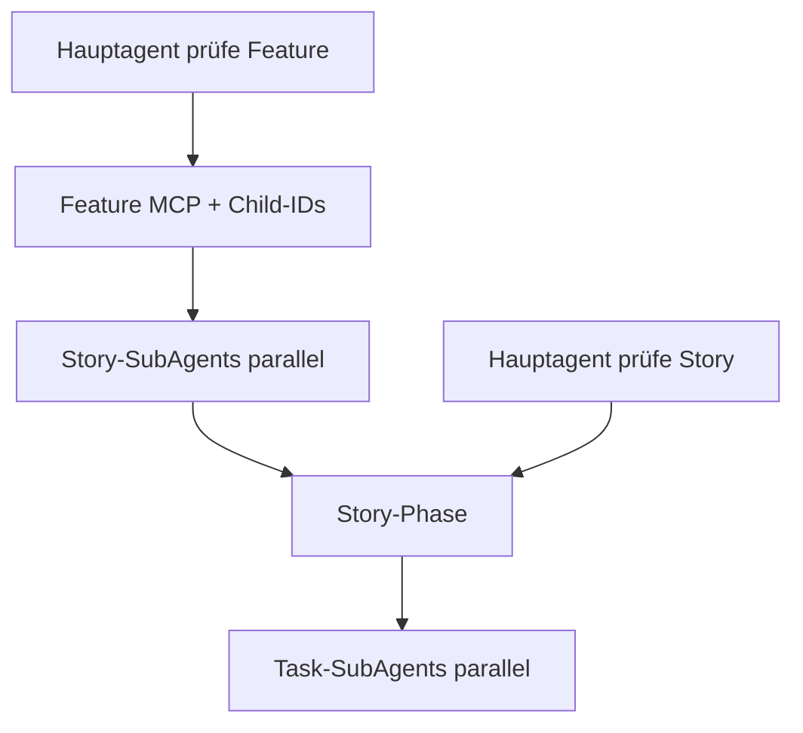

## Parameter

| Parameter | Beschreibung |
|-----------|-------------|
| `ADO.Organisation` | Azure DevOps Organisation (z. B. `MeineFirma`) |
| `ADO.Project-GUID` | Azure DevOps Projekt-GUID |

# ADO ↔ requests/stories (Markdown-only)

Portable Skill: Azure DevOps Work Items per **MCP `ado`** lesen und gezielt schreiben (Discussion, State), lokale **Markdown**-Artefakte unter `requests/stories/` pflegen.

Referenz-Story: `requests/stories/UserStory-{id}-{Titel}/`.

## Zweck und Non-Goals

**In Scope**

- Work Item per ID abrufen und mit lokalem Ordner abgleichen
- **`prüfe Feature`:** Feature-Kontext laden; **parallele Story-Subagents** pro Child-Story; pro Story **parallele Task-Subagents** (Code + Task-MD) — [references/feature-pruefe.md](references/feature-pruefe.md), [references/story-pruefe-subagent.md](references/story-pruefe-subagent.md), [references/task-pruefe-subagent.md](references/task-pruefe-subagent.md)
- Story- und Task-Markdown anlegen/aktualisieren (Obsidian-Wikilinks); **`(x)`-Markierungen** aus Story-Description in Analyse und Task-Übersicht — [description-x-markers.md](references/description-x-markers.md); pro Task **`## Akzeptanzkriterien`** (Planung, Umsetzung, Testabsicherung) — [acceptance-criteria.md](references/acceptance-criteria.md)
- Task-Schließung und ToDos über **Discussion**-Kommentare (`[{markerVersion}]`) an der **Story**
- **`Task … verfeinern` (Legacy):** interaktiver Klärungsworkflow — [references/task-verfeinern.md](references/task-verfeinern.md)
- **Task klären (Standard):** **buddy-agent** — Plan-Prompt für `plan-agent`; siehe [buddy-agent.md](../../agents/buddy-agent.md), Rule [buddy-agent-skill.mdc](../../rules/buddy-agent-skill.mdc)
- Story-State `active` / `resolved` in ADO

**Non-Goals**

- **Kein HTML** erzeugen, pflegen oder verlinken in neuen Story-Dateien
- **Kein** Schreiben an `System.Description` oder Acceptance Criteria
- Keine ADO-Child-Work-Item-**Erstellung**; kein WIQL-**Import** neuer Items (ein WIQL/Relations-**Lesen** der Child-Stories bei Feature-`prüfe` ist erlaubt)
- **Kein** lokaler `UserStory-{featureId}-*`-Ordner nur für das Feature (Tasks aus Feature-Description nicht auf Feature-Ebene materialisieren)
- Kein describe-as-html-prompt-Pfad
- **Kein** Drei-Perspektiven-Review bei `prüfe` oder `verfeinern`
- Code-Stand-Liste „Abgeschlossen (laut Code-Stand)“ bei `prüfe` nur auf explizite Nutzeranfrage (Code-Scout in **Task-Subagents**, nicht für discussion-closed Tasks)

## Voraussetzungen

1. MCP-Server **`ado`** erreichbar ([`.cursor/mcp.json`](../../mcp.json))
2. [`config.defaults.json`](config.defaults.json) gelesen — **Organisation** (Org-Name) ≠ **Projekt**-GUID
3. Vor jedem MCP-Aufruf: Tool-Schema lesen ([references/mcp-tools.md](references/mcp-tools.md))

**MCP nicht erreichbar:** Vorgang abbrechen, Nutzer informieren (Auth, `npx`, Netzwerk) — keine halben lokalen Dateien ohne ADO-Abruf bei `prüfe`.

## Repo-Layout

| Element | Muster |
|---------|--------|
| Story-Ordner | `requests/stories/UserStory-{id}-{titleSlug}/` |
| Story-MD | `UserStory-{id}-{titleSlug}.md` |
| Tasks | `tasks/task-{kebab-slug}.md` |
| Wikilink Task | `[[tasks/task-{slug}\|>> Label <<<]]` |
| Rücklink Task | `← [[../UserStory-{id}-{slug}\|Story #{id}]]` |

Templates: [templates/](templates/). Feld-Mapping: [references/field-mapping.md](references/field-mapping.md). Akzeptanzkriterien: [references/acceptance-criteria.md](references/acceptance-criteria.md). `prüfe`-Subagents: [references/story-pruefe-subagent.md](references/story-pruefe-subagent.md), [references/task-pruefe-subagent.md](references/task-pruefe-subagent.md), [subagent-prompts.md](subagent-prompts.md). Task verfeinern: [references/task-verfeinern.md](references/task-verfeinern.md). Copy-Befehle: [references/copy-commands.md](references/copy-commands.md).

## Konfiguration

- JSON: [config.defaults.json](config.defaults.json)
- Erklärung Org vs. Projekt: [references/config.md](references/config.md)
- Marker: [references/markers.md](references/markers.md)
- States: [references/state-mapping.md](references/state-mapping.md)
- Copy-Befehle: [references/copy-commands.md](references/copy-commands.md)

## Copy-Befehle (Möglichkeiten)

Am Ende von Story- und Task-Markdown steht `## Möglichkeiten` mit **fertig ausgefüllten** Backtick-Zeilen zum Kopieren (Format: [copy-commands.md](references/copy-commands.md)).

**Wann erzeugen oder aktualisieren**

- Neue `task-*.md` aus Template (enthält Block bereits).
- `prüfe`: fehlenden Block anfügen oder bestehenden Block `## Möglichkeiten` … bis vor nächstes `##` / EOF **ersetzen** (idempotent).
- Unter `## Offene Fragen`: Zeile `` `Task {dateistamm} in Story {id} verfeinern` `` **nur** wenn ≥1 Fragen-Bullet; setzen/aktualisieren, **nicht** duplizieren.
- Umbenennung `task-*.md` oder explizite Nutzeranfrage „Möglichkeiten aktualisieren“.

**Geschützt (nie blind überschreiben)**

- `## Umsetzung`, `## Nutzer-ToDos` (Inhalt).
- Verfeinerungs-Abschnitte bei `prüfe`: **Task-SubAgent** schreibt schlankes Initial-Schema ([task-pruefe-subagent.md](references/task-pruefe-subagent.md)); Story-Phase **nicht**. Bei **`Task … verfeinern`**: interaktiver 5-Phasen-Ablauf — [task-verfeinern.md](references/task-verfeinern.md). **`## Story-Bezug`:** bei `verfeinern` nur bei geänderter Story-Quelle überschreiben.
- `## Akzeptanzkriterien`: bei `prüfe` durch **Task-SubAgent** ersetzen (discussion-offene Tasks) — [acceptance-criteria.md](references/acceptance-criteria.md).
- `## Feature-Kontext`: bei Feature-`prüfe` den **gesamten Abschnitt** ersetzen (idempotent) — kein Mischen mit manuellen Zusätzen außerhalb des Blocks.
- **`Task … verfeinern`** → [task-verfeinern.md](references/task-verfeinern.md) (interaktiv; **kein** autonomes MD-Schreiben ohne Nutzer-Freigabe).
- **`plane Task …`** → [planning-workflow](../planning-workflow/SKILL.md) — **keine** ADO-MCP-Operation; finales Planpaket **im Chat**; Task-MD höchstens `### Planung` / `AC-P*` nach Freigabe.

## Delegation und Modellwahl (ADO-Subagents bei `prüfe`)

**Keine** Nutzer-Keywords zur Modellwahl. Slug-Ketten **nur** in `.cursor/agents/` (Abschnitt **`## Modell`** primär, sonst YAML) — **nicht** in diesem Skill duplizieren.

**Subagent — Modell vor Task (Pflicht):** [subagent-model-before-task.md](../../references/subagent-model-before-task.md).

### Agent-Profile (empfohlen: `devops-organisator`)

| Rolle | Agent-Typ | Profil |
|-------|-----------|--------|
| Orchestrator | `devops-organisator` | [devops-organisator.md](../../agents/devops-organisator.md) |
| Story-`prüfe` | `ado-story-pruefe-agent` | [ado-story-pruefe-agent.md](../../agents/ado-story-pruefe-agent.md) |
| Task-`prüfe` | `ado-task-pruefe-agent` | [ado-task-pruefe-agent.md](../../agents/ado-task-pruefe-agent.md) |
| Task klären (Plan-Prompt, Standard) | `buddy-agent` | [buddy-agent.md](../../agents/buddy-agent.md) |
| `Task … verfeinern` (**Legacy**) | Orchestrator/Hauptagent (interaktiv) | [devops-organisator.md](../../agents/devops-organisator.md) — [task-verfeinern.md](references/task-verfeinern.md) |

Details: [references/story-pruefe-subagent.md](references/story-pruefe-subagent.md), [references/task-pruefe-subagent.md](references/task-pruefe-subagent.md).

**Parallelität:** Bis **10** Story-Subagents und **10** Task-Subagents pro Welle; bei mehr IDs Host-Batching dokumentieren.

**Subagents nur über Task-Tool:** **Verboten:** Rollensimulation im Hauptagenten-Turn statt Story-/Task-Subagents bei `prüfe`. **`Task … verfeinern`:** interaktiv im Hauptagent/Orchestrator — kein Background-Subagent für autonomes MD-Schreiben. Task-Tool nicht verfügbar bei `prüfe` → **`BLOCKER`** ([references/task-verfeinern.md](references/task-verfeinern.md) analog).

**Topologie (Kurz):**

## Operationen

### 1. `prüfe` — Story / Task / Feature + DevOps-ID

**Trigger (Beispiele):** `prüfe Story 287638`, `prüfe User Story mit Nummer 287638`, `prüfe Feature 288376`, Work-Item-ID + Story-/requests-Bezug.

**Verzweigung nach Work-Item-Typ**

1. ID aus Nutzertext extrahieren.
2. MCP: `wit_get_work_item` (`project` = `defaultProject` aus Config).
3. Anhand `System.WorkItemType`:
   - **Feature** → **Feature-`prüfe`** (Hauptagent + Story-Subagents).
   - **User Story** (o. ä.) → **Story-`prüfe`** (Hauptagent = Story-Orchestrator).
   - **Task** → Parent-Story-ID (`System.Parent`); dann **Story-`prüfe`** (optional Feature-Kontext nachladen).

#### Feature-`prüfe` (`prüfe Feature {featureId}`)

Vollständig: [references/feature-pruefe.md](references/feature-pruefe.md).

1. **Hauptagent:** Phase A/B — Feature-Kontext-Objekt + Child-User-Story-IDs (sortiert).
2. **Hauptagent:** Pro `storyId` **ein** [Story-SubAgent](references/story-pruefe-subagent.md) (parallel, max. 10/Welle), Prompt [subagent-prompts.md](subagent-prompts.md).
3. **Hauptagent:** Story-Berichte mergen → Feature-Abschlussbericht.

**Kein** Ordner `UserStory-{featureId}-*`.

#### Story-`prüfe` (`prüfe Story {storyId}` oder via Story-SubAgent)

**Orchestrator:** Bei **`prüfe Story`** der **Hauptagent**; bei **Feature-Kaskade** der **Story-SubAgent**. Ablauf identisch — [references/story-pruefe-subagent.md](references/story-pruefe-subagent.md):

1. Story MCP + Discussion; Ordner/Story-MD; optional `## Feature-Kontext`.
2. **Task-Inventar** aus **Story-Description** (nicht Feature-Description); `(x)`-Parsing — [description-x-markers.md](references/description-x-markers.md).
3. `## Description-Analyse (ADO (x))` + `## Task-Übersicht` + Marker-Sync — **ohne** Code-Stand-Scout.
4. `## Möglichkeiten` an Story-MD.
5. Pro discussion-offenem Task **ohne** ADO-`(x)` auf zugeordnetem Description-Punkt: **[Task-SubAgent](references/task-pruefe-subagent.md)** (parallel, max. 10/Welle) — Code-Analyse + schlanke `task-*.md` inkl. `## Akzeptanzkriterien`.
6. Task-Übersicht finalisieren.

**`TASK-CLOSED`:** Kein Task-SubAgent; AC-Block unverändert ([acceptance-criteria.md](references/acceptance-criteria.md)).

**Abschlussbericht (Story):** ADO-Link, Pfade, Task-Inventar, Anzahl Task-Subagents, je Task `slug` → OK/FAIL + `modelUsed`, offene Fragen; discussion-closed ausgenommen.

**Code-Stand:** Nur auf explizite Nutzeranfrage; nie für `TASK-CLOSED`-Slugs ([task-overview.md](references/task-overview.md)). Feature-Kontext nachladen bei Parent-Feature **optional** bei `prüfe Story`; **Pflicht** nur bei `prüfe Feature`.

### 2. Task als fertig markieren

**Trigger:** `markiere Task … als fertig`, `Task task-maschinenfilter-suchwizard erledigt`, `schließe Task … in Story 287638`.

**Ablauf**

1. Story-ID + `task-slug` auflösen.
2. **`## Akzeptanzkriterien` / `### Testabsicherung`:** alle ACs mit Testbezug; Status idealerweise **`grün`** ([acceptance-criteria.md](references/acceptance-criteria.md)). Sonst Nutzer **warnen** — nur nach expliziter Freigabe „trotzdem schließen“ fortfahren.
3. Idempotenz: letzter Marker prüfen ([references/markers.md](references/markers.md)).
4. `wit_add_work_item_comment` — `format: markdown`, Zeile `TASK-CLOSED`.
5. `task-*.md`: **Erledigt**, Abschnitt **Umsetzung** (mindestens Verweis auf Schließzeitpunkt); Akzeptanzkriterien-Block aktualisieren; Template [task-done.md.template](templates/task-done.md.template) wo sinnvoll.
6. Story-MD: Checkbox `[x]`; **nur** unter „Abgeschlossen (laut Discussion / TASK-CLOSED)“ eintragen; Slug aus „Abgeschlossen (laut Code-Stand)“ und „Offen“ entfernen ([task-overview.md](references/task-overview.md)).

**Verboten:** Description/AC in ADO ändern.

### 3. ToDo diktieren

**Trigger:** `ToDo für Task …: …`, `notiere im Task …`, `dictiere ToDo …`.

**Ablauf**

1. Freitext und Task-Slug ermitteln.
2. In `task-*.md` unter **`## Nutzer-ToDos`**: `- YYYY-MM-DD: …` anhängen.
3. `wit_add_work_item_comment` mit `TODO`-Marker an der **Story**.
4. Idempotenz beachten.

### 4. `active`

**Trigger:** `Story 287638 auf active`, `setze … active`.

**Ablauf**

1. [references/state-mapping.md](references/state-mapping.md): `System.State` → `Active`.
2. `wit_update_work_item` nur State-Feld.
3. Story-MD Status-Zeile aktualisieren.
4. Ordner **nicht** löschen.

### 5. `resolved`

**Trigger:** `Story 287638 resolved`, `schließe Story … resolved`.

**Ablauf**

1. Nutzer **warnen und bestätigen lassen**: Ordner `requests/stories/UserStory-{id}-*` wird gelöscht.
2. `wit_update_work_item` → `Resolved`.
3. Optional: `STORY-RESOLVED`-Kommentar in Discussion.
4. Nach erfolgreichem ADO-Update: gesamten Story-Ordner inkl. `tasks/` löschen.
5. Kurzprotokoll: ADO-Link, gelöschter Pfad, Hinweis Git-Historie.

### 6. Commit-Vorschlag

**Trigger:** `Commit-Vorschlag für Task {taskDateistamm} in Story {storyId}` (Copy aus `## Möglichkeiten` oder sinngleich).

**Ablauf**

1. Story-ID und `tasks/{taskDateistamm}.md` auflösen.
2. Abschnitte lesen: `## Anforderung`; bei Status **Erledigt** zusätzlich `## Umsetzung` ([copy-commands.md](references/copy-commands.md) — Commit-Vorschlag).
3. **Title** und **Description** **auf Englisch** ableiten: Title max. 50 Zeichen, Description max. **400** Zeichen, **mit** `Story #{storyId}`; Längen **hart** einhalten.
4. Ausgabe im Chat: Zeichenzähler (`Title (n/50)`, `Description (n/400)`), optional `git commit -m "…" -m "…"`.

**Verboten:** Task-MD oder ADO ändern; MCP `ado` für diese Operation.

**Reporting:** Story-ID, Task-Dateistamm, verwendete Quellabschnitte — kein ADO-Link zwingend.

### 7. Task verfeinern (**Legacy**)

**Trigger:** `Task {taskDateistamm} in Story {storyId} verfeinern` (Copy aus `## Möglichkeiten` oder sinngleich).

**Standard für Task-Klärung ist buddy-agent** — siehe Abschnitt [Task klären: buddy-agent vs. verfeinern](#task-klären-buddy-agent-standard-vs-verfeinern-legacy). Dieser Abschnitt gilt nur bei **explizitem** `verfeinern`-Trigger.

**Ablauf:** Vollständig [references/task-verfeinern.md](references/task-verfeinern.md) — Kurz: Phasen 1–4 read-only (Code-Abgleich, Fragen-Schleife mit Nutzer, Zusammenfassung mit Mermaid im Chat, Nutzer prüft) → Phase 5 **nur nach Freigabe:** Task-MD mit `## Anforderung`, `## Offene Fragen`, `## Akzeptanzkriterien`; Legacy-Abschnitte entfernen.

**Verboten:** MD-Schreiben ohne Nutzer-Freigabe; `## Vorgehen`/Planpaket in Task-MD; ADO-MCP.

**Reporting:** wie [task-verfeinern.md](references/task-verfeinern.md#reporting-pflicht); geänderte `##`-Abschnitte auflisten.

## Task klären: buddy-agent (Standard) vs. verfeinern (Legacy)

| Situation | Vorrang |
|-----------|---------|
| Task klären / Sparring / Plan-Prompt / `@buddy-agent` / *Task mit Buddy* / *Task durchsprechen* | **buddy-agent** — [buddy-agent.md](../../agents/buddy-agent.md), Rule [buddy-agent-skill.mdc](../../rules/buddy-agent-skill.mdc) |
| Explizit `Task … verfeinern` oder Copy-Zeile `verfeinern` | **Legacy** — dieser Skill, [task-verfeinern.md](references/task-verfeinern.md), Orchestrator [devops-organisator.md](../../agents/devops-organisator.md) |
| Unklar | **Eine** Rückfrage: Buddy (Plan-Prompt) oder klassisch verfeinern? |

**Nutzer-Pipeline (Kurz):** Phase 1 Sync (`prüfe`) → Phase 2 Buddy (Plan-Prompt) → Phase 3 `plane Task` (Planning) → Phase 4 Implementierung → Phase 5 Abschluss (devops-organisator).

## Schutz bestehender Inhalte

- Nie `## Umsetzung`, `## Nutzer-ToDos` blind überschreiben.
- Bei `prüfe`: Task-SubAgent schreibt schlankes Initial-Schema; discussion-closed: **kein** Task-SubAgent, AC unverändert. **`Task … verfeinern`:** interaktiver Klärungsworkflow nach Nutzer-Freigabe.
- Story-Task-Listen: bestehende Wikilinks beibehalten; pro Slug **genau eine** Liste ([task-overview.md](references/task-overview.md)).
- Zwei Checkbox-Kategorien **gegenseitig ausschließend**: **Discussion (TASK-CLOSED)** schließt **Code-Stand** und Repo-Abgleich bei `prüfe` aus.

## Akzeptanzkriterien und Tests (verbindlich)

Details: [references/acceptance-criteria.md](references/acceptance-criteria.md).

- **Bei `prüfe`:** Task-SubAgent pflegt `### Lesbar`, `### Planung`, `### Umsetzung`, `### Testabsicherung` ([task-pruefe-subagent.md](references/task-pruefe-subagent.md)).
- **`Task … verfeinern`:** interaktiver Klärungsworkflow + AC-Ableitung nach Freigabe — [task-verfeinern.md](references/task-verfeinern.md); **kein** Vorgehen/Planpaket in die MD.
- **`plane Task …`:** [planning-workflow](../planning-workflow/SKILL.md) — Planpaket und Slices **im Chat**; referenzieren `AC-P*` aus der Task-MD.
- **Umsetzung** ([implementation-workflow](../implementation-workflow/SKILL.md)): Definition of Done = alle `AC-I*` **grün** in Testabsicherung; Verifikations-Subagents decken die genannten Tests ab.
- **Abschluss:** Task nur schließen, wenn Testabsicherung vollständig und (nach Verifikation) **grün** — siehe Operation „Task als fertig markieren“.

## Zusammenspiel andere Workflows

| Situation | Skill |
|-----------|--------|
| `prüfe` | **dieser Skill** — Story-/Task-Subagents ([story-pruefe-subagent.md](references/story-pruefe-subagent.md), [task-pruefe-subagent.md](references/task-pruefe-subagent.md)); **ohne** Drei-Perspektiven-Review |
| Task klären / Plan-Prompt (Standard) | **buddy-agent** — [buddy-agent.md](../../agents/buddy-agent.md); End-Artefakt für `plane Task` |
| `Task … verfeinern` (**Legacy**) | **dieser Skill** — [task-verfeinern.md](references/task-verfeinern.md) (interaktiv, Freigabe-Gate; nach Story-Änderung oder wenn `prüfe`-MD veraltet) |
| `plane Task …` / Umsetzungsplan | [planning-workflow](../planning-workflow/SKILL.md) — bevorzugte Eingabe: **Plan-Prompt aus Buddy**; Scope/DoD aus Task `### Planung` + `AC-P*`; Topologie **im Chat** |
| Code umsetzen | [implementation-workflow](../implementation-workflow/SKILL.md) — DoD aus `### Umsetzung` + `AC-I*`; Tests in `### Testabsicherung` grün |
| Handoff als Markdown-Prompt | [describe-as-prompt](../describe-as-prompt/SKILL.md) — **nicht** HTML |

## Reporting (Pflicht)

Jede Operation endet mit:

- Work-Item-ID und ADO-URL
- Geänderte/neu angelegte Pfade unter `requests/stories/`
- Posted/skipped Discussion-Marker
- Bei `resolved`: Bestätigung + gelöschter Pfad
- Offene Punkte / MCP-Fehler / `BLOCKER` (Subagent-Modell, Task-Tool)
- Bei `prüfe`: Anzahl Story-Subagents (0 bei direktem `prüfe Story`) / Task-Subagents; je Task verwendetes Modell-Slug
- Tasks: fehlende oder ungetestete Akzeptanzkriterien (`AC-*` ohne Zeile oder Status `offen` in Testabsicherung)

## Opt-out

Nutzer sagt ausdrücklich **`ohne ado-story-skill`**, **`ohne ado-requests-skill`**, **`no ado requests skill`** → diesen Skill nicht laden.

## Pflegehinweis

Änderungen an Triggern: `description` in dieser Datei **und** [`.cursor/rules/ado-requests-stories-skill.mdc`](../../rules/ado-requests-stories-skill.mdc) **und** [{agent-index}]({agent-index}) synchron halten.
