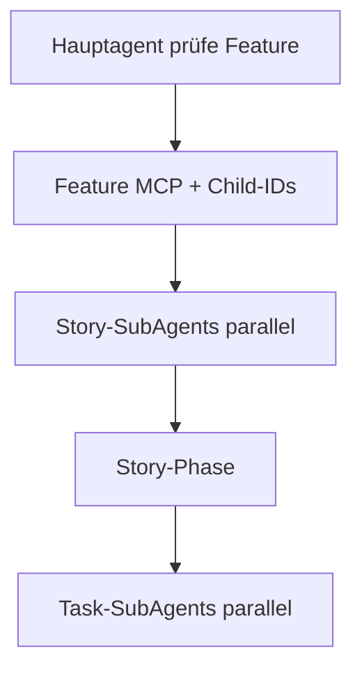

# ADO ↔ requests/stories — Feature prüfen

Portable Skill: Azure DevOps Features per **MCP `ado`** lesen, parallele Story-Subagents starten.

## Voraussetzungen

1. MCP-Server **`ado`** erreichbar ([`../../mcp.json`](../../mcp.json))
2. [`../config.defaults.json`](../config.defaults.json) gelesen — **Organisation** (Org-Name) ≠ **Projekt**-GUID
3. Vor jedem MCP-Aufruf: Tool-Schema lesen ([`mcp-tools.md`](mcp-tools.md))

**MCP nicht erreichbar:** Vorgang abbrechen, Nutzer informieren — keine halben lokalen Dateien ohne ADO-Abruf.

## Konfiguration

- JSON: [`../config.defaults.json`](../config.defaults.json)
- Erklärung Org vs. Projekt: [`config.md`](config.md)
- MCP-Tools: [`mcp-tools.md`](mcp-tools.md)

## Operation: `prüfe Feature {featureId}`

**Trigger (Beispiele):** `prüfe Feature 288376`, Feature-ID + requests/stories-Bezug.

Vollständig: [`feature-pruefe.md`](feature-pruefe.md).

### Phase A — Feature-Kontext laden (Hauptagent)

1. `wit_get_work_item` — Feature-ID, `project` = `defaultProject`, optional `expand: relations`.
2. `wit_list_work_item_comments` — Feature-ID (nur **Kontext**).
3. Feature-Kontext **zusammenfassen**: Description, AC, relevante Discussion.

**Feature-Kontext-Objekt** (mindestens): `featureId`, `featureTitle`, `featureAdoUrl`, `descriptionSummary`, `acSummary`, `discussionSummary`.

### Phase B — Child-User-Stories ermitteln (Hauptagent)

Relations `System.LinkTypes.Hierarchy-Forward` oder WIQL. Sortierung: Child-Story-IDs **aufsteigend**.

**0 User Stories:** Abschlussbericht: Feature-Kontext geladen, keine Child-Stories, keine Story-Ordner.

### Phase C — Parallele Story-Subagents

Pro Child-`storyId` **einen** [`ado-story-pruefe-agent`](../../agents/ado-story-pruefe-agent.md) starten (parallel, max. **10**/Welle; Host-Batching bei mehr).

Jeder Story-SubAgent führt die Story-Phase aus ([`story-pruefe-subagent.md`](story-pruefe-subagent.md)) inkl. paralleler Task-Subagents.

**Kein** Ordner `UserStory-{featureId}-*`.

**Topologie (Kurz):**

## Subagent-Prompts

Prompt-Vorlagen: [`../subagent-prompts.md`](../subagent-prompts.md).

## Abschlussbericht (`prüfe Feature`)

- Feature-ID, ADO-URL, Kurz-Feature-Kontext (1–3 Sätze)
- Anzahl Child-Stories; Anzahl Story-Subagents / Wellen
- Tabelle: `storyId` → OK/Fehler, Task-Anzahl, Task-Subagent-Zusammenfassung, Modell-Slugs
- Hinweis: **kein** lokaler Feature-Ordner

## Opt-out

Nutzer sagt ausdrücklich **`ohne ado-story-skill`**, **`ohne ado-requests-skill`**, **`no ado requests skill`** → diesen Skill nicht laden.
