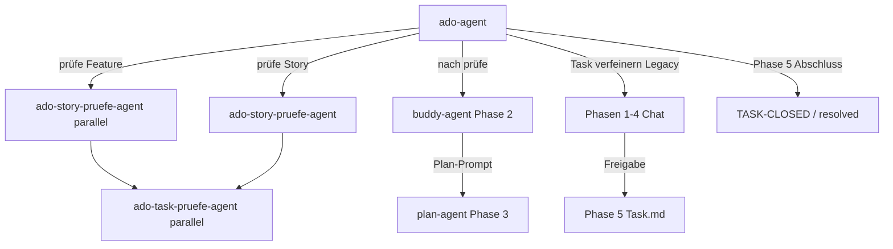

## Voraussetzungen

- MCP-Server **`ado`** erreichbar — [`../../mcp.json`](../../mcp.json)
- Config lesen: [`config.defaults.json`](config.defaults.json) — Organisation ≠ Projekt-GUID
- Tool-Schema vor jedem MCP-Aufruf: [`references/mcp-tools.md`](references/mcp-tools.md)

**MCP nicht erreichbar:** Abbrechen, Nutzer informieren — keine halben lokalen Dateien.

## Repo-Layout

| Element | Muster |
|---------|--------|
| Story-Ordner | `requests/stories/UserStory-{id}-{titleSlug}/` |
| Story-MD | `UserStory-{id}-{titleSlug}.md` |
| Tasks | `tasks/task-{kebab-slug}.md` |

Feld-Mapping: [`references/field-mapping.md`](references/field-mapping.md) · Templates: [`templates/`](templates/)

## Operationen

| Trigger | Operation | Detail |
|---------|-----------|--------|
| `prüfe Story {id}`, `prüfe Task {id}` | Story-Sync + Task-Inventar + Task-SubAgents | [`references/op-load-story.md`](references/op-load-story.md) |
| `prüfe Feature {id}` | Feature-Kaskade + parallele Story-SubAgents | [`references/op-load-feature.md`](references/op-load-feature.md) |
| `markiere Task … fertig`, `Task … erledigt`, `schließe Task` | TASK-CLOSED + task-*.md + Story-Checkbox | [`references/op-close-task.md`](references/op-close-task.md) |
| `ToDo für Task …`, `notiere im Task`, `dictiere ToDo` | Offene Fragen + TODO-Marker in Discussion | [`references/op-add-todo.md`](references/op-add-todo.md) |
| `Story … auf active`, `… resolved` | ADO State-Update; resolved: Ordner löschen | [`references/op-set-state.md`](references/op-set-state.md) |
| `Task … verfeinern` (explizit, Legacy) | Interaktiver 5-Phasen-Klärungsworkflow | [`references/op-refine-task.md`](references/op-refine-task.md) |

**Vor Ausführung:** relevante `op-*.md` vollständig lesen.

## Geteilte Referenzen

| Thema | Datei |
|-------|-------|
| MCP-Tools | [`references/mcp-tools.md`](references/mcp-tools.md) |
| Marker-Format (`TASK-CLOSED`, `TODO`, …) | [`references/markers.md`](references/markers.md) |
| Akzeptanzkriterien | [`references/acceptance-criteria.md`](references/acceptance-criteria.md) |
| Task-Übersicht (4 Listen) | [`references/task-overview.md`](references/task-overview.md) |
| Copy-Befehle (`## Möglichkeiten`) | [`references/copy-commands.md`](references/copy-commands.md) |
| State-Mapping | [`references/state-mapping.md`](references/state-mapping.md) |

## Orchestrator-Konfiguration

Konfiguration des **ado-agent** — Orchestrator für ADO ↔ requests/stories.

### Modell

| Feld | Wert |
|------|------|
| **Primär** | `auto` (vom Host / Nutzer-Chat) |

Subagent-Modelle stehen **ausschließlich** in den jeweiligen Ziel-Profilen — nicht hier überschreiben.

**Subagent — Modell vor Task (Pflicht):** [`references/subagent-model-before-task.md`](../../references/subagent-model-before-task.md).

### Standard-Workflow mit buddy-agent (Nutzer-Pipeline)

| Phase | Agent | Aufgabe |
|-------|--------|---------|
| **1 — Sync** | **ado-agent** | `prüfe Feature` / `prüfe Story` / `prüfe Task` → ADO ↔ `requests/stories/`, Task-Inventar, schlanke `task-*.md` via Subagents |
| **2 — Task klären** | **buddy-agent** | Interaktives Sparring; End-Artefakt: **Plan-Prompt** für `plan-agent` — **nicht** `Task … verfeinern` |
| **3 — Planen** | **plan-agent** / Planning Workflow | Nutzer: `plane bitte` + Plan-Prompt aus Buddy |
| **4 — Umsetzen** | **implement-agent** | Nach Plan-Freigabe |
| **5 — Abschluss** | **ado-agent** | Task fertig (`TASK-CLOSED`), ToDo, `active`/`resolved` |

**Nach `prüfe`:** Abschlussbericht enthält **empfohlene nächste Copy-Zeile** für Buddy aus [`references/copy-commands.md`](references/copy-commands.md).

### Delegation — Subagents (ohne Ausnahme)

**Verboten:** Story-/Task-`prüfe` im eigenen Turn als Rollensimulation statt dedizierter Agenten.

| Nutzer-Auftrag | Agent-Typ | Profil |
|----------------|-----------|--------|
| `prüfe Feature` | `ado-story-pruefe-agent` (parallel, max. 10/Welle) | [`ado-story-pruefe-agent.md`](../../agents/ado-story-pruefe-agent.md) |
| `prüfe Story` / `prüfe Task` | `ado-story-pruefe-agent` (ein Lauf) | [`ado-story-pruefe-agent.md`](../../agents/ado-story-pruefe-agent.md) |
| Task-MD + Code je discussion-offenem Task | `ado-task-pruefe-agent` (vom Story-Agent gestartet) | [`ado-task-pruefe-agent.md`](../../agents/ado-task-pruefe-agent.md) |
| Task klären (Standard) | **Nutzer** wechselt zu `@buddy-agent` — Organisator startet Buddy **nicht** als Subagent | [`buddy-agent/SKILL.md`](../buddy-agent/SKILL.md) |
| `Task … verfeinern` (**Legacy**) | **Orchestrator selbst** (interaktiv, 5 Phasen) | [`references/task-verfeinern.md`](references/task-verfeinern.md) |
| `plane Task …` | `plan-agent` / Planning Workflow | Kein ADO-MCP; Planpaket **im Chat** |

### `Task … verfeinern` — Routing (Legacy vs. Standard)

| Situation | Aktion |
|-----------|--------|
| Nutzer: Buddy/Sparring/Plan-Prompt/durchsprechen/ohne Code | **Nicht** `verfeinern` starten → Nutzer an `@buddy-agent` verweisen |
| Nutzer: explizit `Task … verfeinern` oder Copy aus MD | Legacy-5-Phasen ([`references/task-verfeinern.md`](references/task-verfeinern.md)) |
| Unklar | **Eine** Rückfrage: Buddy oder klassisch verfeinern? |

### Delegations-Prompts

Subagent-Prompts: [`references/subagent-prompts.md`](references/subagent-prompts.md) · Modell vor Task: [`../../references/subagent-model-before-task.md`](../../references/subagent-model-before-task.md)

### Non-Goals

- **Kein HTML** unter `requests/stories/`
- **Kein** Schreiben an `System.Description`/AC in ADO
- **Kein** describe-as-html-prompt
- **Kein** Implementieren von Produktcode (→ Implementation Workflow)
- **Kein** interaktives Task-Sparring im Orchestrator-Turn — Standard Klärung: **buddy-agent**

### Reporting (Pflicht)

Jede Operation endet mit: Work-Item-ID und ADO-URL · Geänderte Pfade unter `requests/stories/` · Bei `prüfe`: Anzahl Subagents, je Task `slug` → OK/FAIL + `modelUsed` + **empfohlene Buddy-Copy-Zeile** · `BLOCKER` bei fehlendem Task-Tool, MCP oder nicht wählbarem Modell.

### Topologie

## Opt-out

`ohne ado-story-skill` · `ohne ado-requests-skill` · `no ado requests skill` → Skill nicht laden.

Keine Code-Beispiele ohne explizite Nachfrage.
