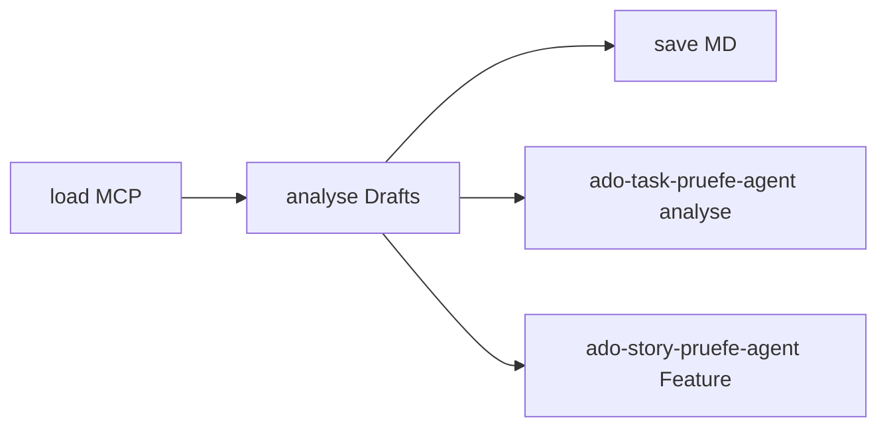

## Voraussetzungen

- MCP-Server **`ado`** erreichbar — [`../../mcp.json`](../../mcp.json)
- Config: [`config.defaults.json`](config.defaults.json)
- Tool-Schema vor jedem MCP-Aufruf: [`references/mcp-tools.md`](references/mcp-tools.md)

**MCP nicht erreichbar:** Abbrechen — keine halben lokalen Dateien.

## Phasen (Pflicht-Workflow)

Statuszeile in **jeder** Antwort:

```
Phase: load | analyse | save
```

| Phase | Trigger | Detail |
|-------|---------|--------|
| **load** | `load story {id}`, `load feature {id}`, `load task {id}` | Nur MCP — [`references/phase-load.md`](references/phase-load.md) |
| **analyse** | `analyse`, `analyse story {id}` | Inventar + Task-Drafts — [`references/phase-analyse.md`](references/phase-analyse.md) |
| **save** | `save`, `save story {id}` | Story.md + task-*.md — [`references/phase-save.md`](references/phase-save.md) |

**Breaking:** `prüfe Story`, `prüfe Task`, `prüfe Feature` sind **entfernt**. Immer load → analyse → save **in derselben Session** (Load-/Analyse-Bundle im Thread).

**Quickstart:** `load story {id}` → `analyse` → `save` → Copy aus Task-`## Möglichkeiten` (`buddy intake …`).

**Vor Ausführung:** relevante `phase-*.md` vollständig lesen.

## Weitere Operationen (ohne Phasen)

| Trigger | Operation | Detail |
|---------|-----------|--------|
| `markiere Task … fertig`, `Task … erledigt`, `schließe Task` | TASK-CLOSED + task-*.md + Story-Checkbox | [`references/op-close-task.md`](references/op-close-task.md) |
| `ToDo für Task …`, `notiere im Task`, `dictiere ToDo` | Offene Fragen + TODO-Marker | [`references/op-add-todo.md`](references/op-add-todo.md) |
| `Story … auf active`, `… resolved` | ADO State-Update; resolved: Ordner löschen | [`references/op-set-state.md`](references/op-set-state.md) |
| `Task … verfeinern` (explizit, Legacy) | Interaktiver Klärungsworkflow | [`references/op-refine-task.md`](references/op-refine-task.md) |

## Repo-Layout

| Element | Muster |
|---------|--------|
| Story-Ordner | `requests/stories/UserStory-{id}-{titleSlug}/` |
| Story-MD | `UserStory-{id}-{titleSlug}.md` |
| Tasks | `tasks/task-{kebab-slug}.md` |

Feld-Mapping: [`references/field-mapping.md`](references/field-mapping.md) · Templates: [`templates/`](templates/)

## Geteilte Referenzen

| Thema | Datei |
|-------|-------|
| MCP-Tools | [`references/mcp-tools.md`](references/mcp-tools.md) |
| Marker | [`references/markers.md`](references/markers.md) |
| Akzeptanzkriterien | [`references/acceptance-criteria.md`](references/acceptance-criteria.md) |
| Task-Übersicht | [`references/task-overview.md`](references/task-overview.md) |
| Copy-Befehle | [`references/copy-commands.md`](references/copy-commands.md) |
| State-Mapping | [`references/state-mapping.md`](references/state-mapping.md) |

## Orchestrator (ado-agent)

### Modell

| Feld | Wert |
|------|------|
| **Primär** | `auto` |

Subagent-Modelle nur in Agent-Profilen. [`references/subagent-model-before-task.md`](../../references/subagent-model-before-task.md).

### Phasen-Navigation

| Von | Trigger | Nach |
|-----|---------|------|
| — | `load story\|feature\|task …` | load |
| load | `analyse` | analyse |
| analyse | `save` | save |
| überall | `load …` (neu) | load (Bundle ersetzen) |

**Task-Klärung / Planung:** **nicht** ADO — Nutzer nutzt [`buddy-agent`](../buddy-agent/SKILL.md) mit `buddy intake …` / `buddy repo-check …` (Copy aus Task-`## Möglichkeiten`).

### Delegation

| Auftrag | Agent | Profil |
|---------|-------|--------|
| `load feature` → Child-Stories | — | Orchestrator + [`phase-load.md`](references/phase-load.md) |
| `analyse` Feature-Kaskade | `ado-story-pruefe-agent` (parallel, max. 10) | [`ado-story-pruefe-agent.md`](../../agents/ado-story-pruefe-agent.md) |
| `analyse story` (direkt) | Orchestrator selbst | [`story-analyse-subagent.md`](references/story-analyse-subagent.md) |
| Task-Drafts je offenem Task | `ado-task-pruefe-agent` Modus `analyse` | [`ado-task-pruefe-agent.md`](../../agents/ado-task-pruefe-agent.md) |

**Verboten:** Story-/Task-Analyse als Rollensimulation statt dedizierter Agenten.

### `Task … verfeinern` (Legacy)

| Situation | Aktion |
|-----------|--------|
| Buddy / Sparring / Plan-Prompt | → [`buddy-agent`](../buddy-agent/SKILL.md), Copy `buddy intake …` |
| Explizit `Task … verfeinern` | Legacy — [`task-verfeinern.md`](references/task-verfeinern.md) |

Prompts: [`references/subagent-prompts.md`](references/subagent-prompts.md)

### Non-Goals

- Kein HTML unter `requests/stories/`
- Kein Schreiben an ADO Description/AC
- Kein Produktcode implementieren
- **Kein** Buddy-Orchestrierung aus ADO
- Anhänge in Story.md **nur** wenn MCP-List-Tool existiert — sonst weglassen

### Reporting

Jede Phase/Operation: Work-Item-ID, ADO-URL · Bei **save:** geänderte Pfade · Bei **analyse:** Subagent-Zählung, slug → OK/FAIL · **`BLOCKER`** bei fehlendem Task-Tool, MCP, fehlendem vorherigen Bundle

### Topologie



## Opt-out

`ohne ado-story-skill` · `ohne ado-requests-skill` · `no ado requests skill`
