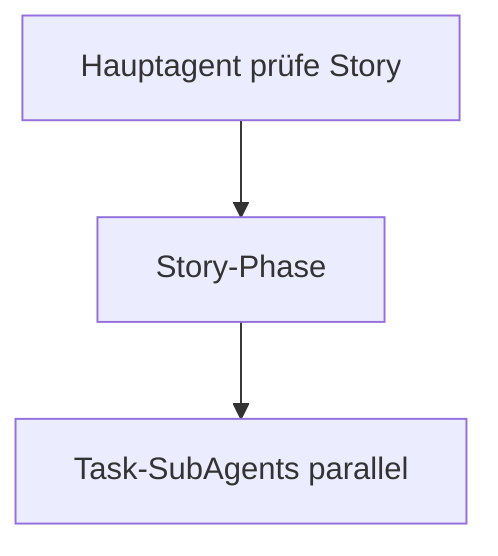

# ADO ↔ requests/stories — Story/Task prüfen

Portable Skill: Azure DevOps User Stories und Tasks per **MCP `ado`** lesen, lokale **Markdown**-Artefakte unter `requests/stories/` pflegen.

Referenz-Story: `requests/stories/UserStory-{id}-{Titel}/`.

## Voraussetzungen

1. MCP-Server **`ado`** erreichbar ([`../../mcp.json`](../../mcp.json))
2. [`../config.defaults.json`](../config.defaults.json) gelesen — **Organisation** (Org-Name) ≠ **Projekt**-GUID
3. Vor jedem MCP-Aufruf: Tool-Schema lesen ([`mcp-tools.md`](mcp-tools.md))

**MCP nicht erreichbar:** Vorgang abbrechen, Nutzer informieren (Auth, `npx`, Netzwerk) — keine halben lokalen Dateien ohne ADO-Abruf bei `prüfe`.

## Repo-Layout

| Element | Muster |
|---------|--------|
| Story-Ordner | `requests/stories/UserStory-{id}-{titleSlug}/` |
| Story-MD | `UserStory-{id}-{titleSlug}.md` |
| Tasks | `tasks/task-{kebab-slug}.md` |
| Wikilink Task | `[[tasks/task-{slug}\|>> Label <<<]]` |
| Rücklink Task | `← [[../UserStory-{id}-{slug}\|Story #{id}]]` |

Templates: [`../templates/`](../templates/). Feld-Mapping: [`field-mapping.md`](field-mapping.md). Akzeptanzkriterien: [`acceptance-criteria.md`](acceptance-criteria.md). `prüfe`-Subagents: [`story-pruefe-subagent.md`](story-pruefe-subagent.md), [`task-pruefe-subagent.md`](task-pruefe-subagent.md), [`subagent-prompts.md`](subagent-prompts.md). Copy-Befehle: [`copy-commands.md`](copy-commands.md).

## Konfiguration

- JSON: [`../config.defaults.json`](../config.defaults.json)
- Erklärung Org vs. Projekt: [`config.md`](config.md)
- Marker: [`markers.md`](markers.md)
- States: [`state-mapping.md`](state-mapping.md)
- Copy-Befehle: [`copy-commands.md`](copy-commands.md)

## Copy-Befehle (Möglichkeiten)

Story-Markdown enthält `## Möglichkeiten` mit **fertig ausgefüllten** Backtick-Zeilen zum Kopieren (Format: [`copy-commands.md`](copy-commands.md)). Task-Markdown enthält **kein** `## Möglichkeiten`.

**Wann erzeugen oder aktualisieren (Story-MD)**

- Neue Story-MD aus Template (enthält Block bereits).
- `prüfe`: fehlenden Block anfügen oder bestehenden Block `## Möglichkeiten` … bis vor nächstes `##` / EOF **ersetzen** (idempotent).
- Unter `## Offene Fragen` in Task-MD: Zeile `` `Task {dateistamm} in Story {id} verfeinern` `` **nur** wenn ≥1 Fragen-Bullet; setzen/aktualisieren, **nicht** duplizieren.

## Delegation und Modellwahl (ADO-Subagents bei `prüfe`)

**Keine** Nutzer-Keywords zur Modellwahl. Slug-Ketten **nur** in `.cursor/agents/` (Abschnitt **`## Modell`** primär, sonst YAML) — **nicht** in diesem Skill duplizieren.

**Subagent — Modell vor Task (Pflicht):** [`../../../references/subagent-model-before-task.md`](../../../references/subagent-model-before-task.md).

### Agent-Profile (empfohlen: `ado-agent`)

| Rolle | Agent-Typ | Profil |
|-------|-----------|--------|
| Orchestrator | `ado-agent` | [`../SKILL.md`](../SKILL.md) |
| Story-`prüfe` | `ado-story-pruefe-agent` | [`../../agents/ado-story-pruefe-agent.md`](../../agents/ado-story-pruefe-agent.md) |
| Task-`prüfe` | `ado-task-pruefe-agent` | [`../../agents/ado-task-pruefe-agent.md`](../../agents/ado-task-pruefe-agent.md) |
| Task klären (Plan-Prompt, Standard) | `buddy-agent` | [`../../buddy-agent/SKILL.md`](../../buddy-agent/SKILL.md) |

Details: [`story-pruefe-subagent.md`](story-pruefe-subagent.md), [`task-pruefe-subagent.md`](task-pruefe-subagent.md).

**Parallelität:** Bis **10** Story-Subagents und **10** Task-Subagents pro Welle; bei mehr IDs Host-Batching dokumentieren.

**Subagents nur über Task-Tool:** **Verboten:** Rollensimulation im Hauptagenten-Turn statt Story-/Task-Subagents bei `prüfe`. Task-Tool nicht verfügbar bei `prüfe` → **`BLOCKER`**.

**Topologie (Kurz):**

## Operation: `prüfe` — Story / Task + DevOps-ID

**Trigger (Beispiele):** `prüfe Story 287638`, `prüfe User Story mit Nummer 287638`, Work-Item-ID + Story-/requests-Bezug.

**Verzweigung nach Work-Item-Typ**

1. ID aus Nutzertext extrahieren.
2. MCP: `wit_get_work_item` (`project` = `defaultProject` aus Config).
3. Anhand `System.WorkItemType`:
   - **Feature** → weiterleiten an [`op-load-feature.md`](op-load-feature.md).
   - **User Story** (o. ä.) → **Story-`prüfe`** (Hauptagent = Story-Orchestrator).
   - **Task** → Parent-Story-ID (`System.Parent`); dann **Story-`prüfe`** (optional Feature-Kontext nachladen).

#### Story-`prüfe` (`prüfe Story {storyId}` oder via Story-SubAgent)

**Orchestrator:** Bei **`prüfe Story`** der **Hauptagent**; bei **Feature-Kaskade** der **Story-SubAgent**. Ablauf identisch — [`story-pruefe-subagent.md`](story-pruefe-subagent.md):

1. Story MCP + Discussion; Ordner/Story-MD; optional `## Feature-Kontext`.
2. **Task-Inventar** aus **Story-Description** (nicht Feature-Description); `(x)`-Parsing — [`description-x-markers.md`](description-x-markers.md).
3. `## Description-Analyse (ADO (x))` + `## Task-Übersicht` + Marker-Sync — **ohne** Code-Stand-Scout.
4. `## Möglichkeiten` an Story-MD.
5. Pro discussion-offenem Task **ohne** ADO-`(x)` auf zugeordnetem Description-Punkt: **[Task-SubAgent](task-pruefe-subagent.md)** (parallel, max. 10/Welle) — Code-Analyse + schlanke `task-*.md` inkl. `## Akzeptanzkriterien`.
6. Task-Übersicht finalisieren.

**`TASK-CLOSED`:** Kein Task-SubAgent; AC-Block unverändert ([`acceptance-criteria.md`](acceptance-criteria.md)).

**Abschlussbericht (Story):** ADO-Link, Pfade, Task-Inventar, Anzahl Task-Subagents, je Task `slug` → OK/FAIL + `modelUsed`, offene Fragen; discussion-closed ausgenommen.

**Code-Stand:** Nur auf explizite Nutzeranfrage; nie für `TASK-CLOSED`-Slugs ([`task-overview.md`](task-overview.md)). Feature-Kontext nachladen bei Parent-Feature **optional** bei `prüfe Story`; **Pflicht** nur bei `prüfe Feature`.

## Schutz bestehender Inhalte

- Nie `## AI Zusammenfassung` bei `verfeinern` überschreiben (Scout-Findings beibehalten).
- Bei `prüfe`: Task-SubAgent schreibt schlankes Initial-Schema; discussion-closed: **kein** Task-SubAgent, AC unverändert. **`Task … verfeinern`:** interaktiver Klärungsworkflow nach Nutzer-Freigabe.
- Story-Task-Listen: bestehende Wikilinks beibehalten; pro Slug **genau eine** Liste ([`task-overview.md`](task-overview.md)).
- Zwei Checkbox-Kategorien **gegenseitig ausschließend**: **Discussion (TASK-CLOSED)** schließt **Code-Stand** und Repo-Abgleich bei `prüfe` aus.

## Akzeptanzkriterien (verbindlich)

Details: [`acceptance-criteria.md`](acceptance-criteria.md).

- **Bei `prüfe`:** Task-SubAgent schreibt `## Akzeptanzkriterien` (menschlich lesbare Bullets, keine IDs) und `## AI Zusammenfassung` ([`task-pruefe-subagent.md`](task-pruefe-subagent.md)).
- **`Task … verfeinern`:** interaktiver Klärungsworkflow + AC-Ableitung nach Freigabe — [`task-verfeinern.md`](task-verfeinern.md); **kein** Vorgehen/Planpaket in die MD.
- **`plane Task …`:** [`planning-workflow`](../../planning-workflow/SKILL.md) — Planpaket und Slices **im Chat**; referenziert Kriterien aus der Task-MD.
- **Umsetzung** ([`implementation-workflow`](../../implementation-workflow/SKILL.md)): DoD an `## Akzeptanzkriterien`; Verifikations-Subagents decken die genannten Kriterien ab.
- **Abschluss:** Task nur schließen wenn Kriterien erfüllt; `### Lösung` in Task-done befüllen.

## Reporting (Pflicht)

Jede Operation endet mit:

- Work-Item-ID und ADO-URL
- Geänderte/neu angelegte Pfade unter `requests/stories/`
- Posted/skipped Discussion-Marker
- Offene Punkte / MCP-Fehler / `BLOCKER` (Subagent-Modell, Task-Tool)
- Bei `prüfe`: Anzahl Story-Subagents (0 bei direktem `prüfe Story`) / Task-Subagents; je Task verwendetes Modell-Slug
- Tasks: fehlende Akzeptanzkriterien oder `### Lösung` (bei erledigten Tasks)

## Opt-out

Nutzer sagt ausdrücklich **`ohne ado-story-skill`**, **`ohne ado-requests-skill`**, **`no ado requests skill`** → diesen Skill nicht laden.
