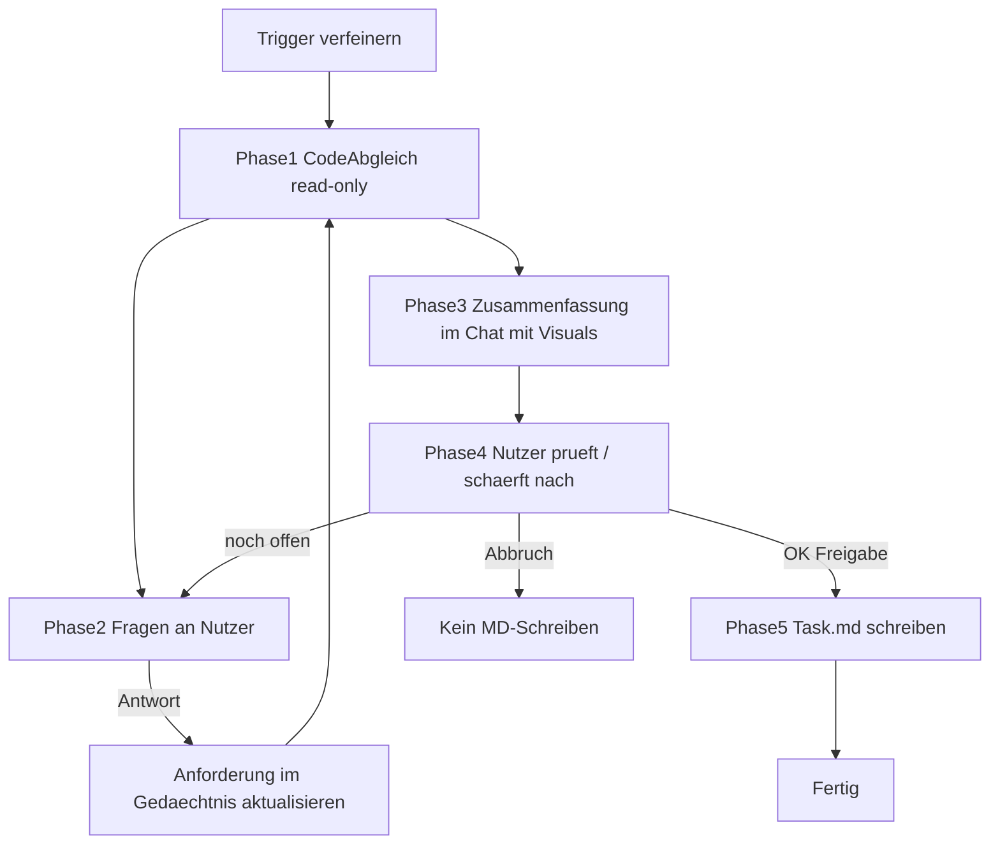
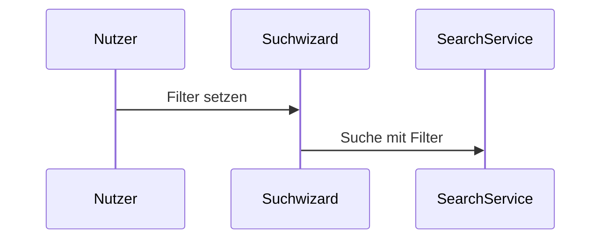

## Parameter

| Parameter | Beschreibung |
|-----------|-------------|
| `{code-root}` | Wurzelpfad des Code-Repositories (z. B. `my-project/`) |
| `{frontend-path}` | Pfad zum Frontend-Projekt innerhalb von `{code-root}` |
| `{backend-path}` | Pfad zum Backend-Projekt innerhalb von `{code-root}` |

# Task verfeinern (`Task … in Story … verfeinern`)

Interaktiver Klärungsworkflow in `tasks/task-*.md` — **nicht** dasselbe wie `plane Task …` (voller [Planning Workflow](../../planning-workflow/SKILL.md) mit Umsetzungs-Topologie im Chat).

## Abgrenzung

| Copy-Befehl | Workflow | Chat | `task-*.md` |
|-------------|----------|------|-------------|
| `load` / `analyse` / `save` | [phase-load/analyse/save](phase-load.md) | Load-/Analyse-Bundles | **save** schreibt schlankes Schema |
| `buddy intake` / `buddy repo-check` | [buddy-agent](../../buddy-agent/SKILL.md) | Sparring | nur **Read** Task.md |
| `Task … verfeinern` | **dieser Ablauf** | Phasen 1–4 read-only; Phase 5 erst nach Nutzer-Freigabe | Nur freigegebene Inhalte |
| `plane Task …` | [planning-workflow](../../planning-workflow/SKILL.md) | Planpaket im Chat | optional `### Planung` |

**Kein** ADO-MCP bei `verfeinern` (wie bei `plane Task`).

## Leitprinzipien

- **Interaktiv:** Mehrere Chat-Turns mit dem Nutzer — **kein** autonomes MD-Schreiben ohne explizite Freigabe.
- **Read-only bis Freigabe:** Phasen 1–4 ändern **keine** Task-MD; Code-Scouts nur read-only.
- **Kein Umsetzungsplan in der Task-MD:** `## Vorgehen`, IMP-IDs, Umsetzungs-Topologie → **`plane Task …`**.
- **Visuell:** Mermaid im Chat (Phase 3–4) und in `## Anforderung` (Phase 5 nach Freigabe).
- **Orchestrator:** Hauptagent oder `ado-agent` führt den Dialog — **nicht** ein Background-Subagent, der die MD autonom schreibt.

## Ablauf (5 Phasen)



| Phase | Modus | Aktion |
|-------|-------|--------|
| **1** | read-only | Task-MD, Story-MD, optional `## Feature-Kontext` lesen; Anforderung mit Code unter `{code-root}/` vergleichen. Optional 1–3 read-only Code-Scouts (`plan-agent-scout` / `explore`) — **kein** MD-Schreiben. |
| **2** | read-only | Offene Fragen / Verständnisprobleme / Unklarheiten **im Chat** stellen (max. wenige pro Runde). Nach jeder Antwort: Verständnis aktualisieren → zurück zu Phase 1. Erst weiter, wenn **keine** neuen Fragen mehr entstehen. |
| **3** | read-only | Zusammenfassung des Verständnisses im Chat — mit **Mermaid** (`sequenceDiagram` bei FE↔BE-Flows, ggf. `flowchart` für Entscheidungen). **Noch nicht** in Task.md. |
| **4** | read-only | Nutzer prüft, korrigiert, schärft nach → ggf. zurück zu Phase 2/1. |
| **5** | **schreibend** | **Nur nach expliziter Freigabe** (`OK`, `passt`, `übernehmen`, sinngleich): freigegebene Inhalte in Task.md übernehmen — inkl. Visuals **innerhalb** `## Anforderung`; `## Akzeptanzkriterien` ableiten. |

### Freigabe-Gate (Phase 5)

**Verboten:** Task-MD schreiben oder ersetzen, solange der Nutzer Phase 3/4 nicht explizit freigegeben hat.

**Freigabe-Signale (Beispiele):** `OK`, `passt`, `übernehmen`, `in den Task schreiben`, `so übernehmen`.

**Keine Freigabe:** Bei Abbruch, offenen Punkten oder weiterer Klärung → **kein** MD-Update; Phase im Chat dokumentieren.

### Code-Scouting (Phase 1, optional)

- Scope: Task-Anforderung + betroffene Pfade (`{frontend-path}`, `{backend-path}`, Gateway, weitere Stacks …).
- Scouts **read-only** — Prompt-Vorlagen: [planning-workflow/subagent-prompts.md](../../planning-workflow/references/subagent-prompts.md).
- **Kein** Drei-Perspektiven-Review (Optimist/Pessimist/Normalo) bei `verfeinern`.
- **Kein** Scout-Rohlog in die Task-MD.

### Wenn Task-Tool nicht verfügbar

Optionaler Scout entfällt; Hauptagent/Orchestrator kann Phase 1 selbst read-only im Repo erkunden. **Kein** MD-Schreiben ohne Nutzer-Freigabe.

## Pflichtabschnitte in der Task-MD

Reihenfolge in der Datei (nach Kopf/Status, vor geschützten Abschnitten) — **verbindliche Sortierung**:

| # | Abschnitt | Zweck | Stil |
|---|-----------|--------|------|
| 1 | `## Anforderung` | Verständnis nach Freigabe — ausgearbeitet | Fließtext + Bullets; Kernaussagen **fett**; optional Mermaid; **kein** IMP-/Slice-Jargon; kein nummeriertes Vorgehen |
| 2 | `## Offene Fragen` | Verständnisprobleme, Unklarheiten, Annahmen | Bullets; Copy-Zeile `Task … verfeinern` nur bei ≥1 echter Frage — [copy-commands.md](copy-commands.md) |
| 3 | `## Story-Bezug` | Punkte aus der **Story**, die diesen Task inspiriert haben | Zitate/Auszüge aus Story-Description, ggf. `## Feature-Kontext`; **keine** Scout-Interpretation |
| 4 | `## Akzeptanzkriterien` | Menschlich lesbare Kriterien, keine IDs | [acceptance-criteria.md](acceptance-criteria.md) — bei Phase 5 aus freigegebener Anforderung ableiten |
| 5 | `## AI Zusammenfassung` | Scout-Findings (Caveman Ultra: was · wie · wo · weshalb) | Aus Phase-1-Code-Scout; bei `verfeinern` aus neuem Scout ableiten oder beibehalten |

### Entfallene Abschnitte (nicht mehr in Task.md)

Diese Abschnitte **nicht** anlegen oder bei `verfeinern` **entfernen** (Block ersetzen durch nichts — idempotent bereinigen):

- `## Original Text` → ersetzt durch `## Story-Bezug`
- `## Zielsetzung` → in `## Anforderung` integrieren
- `## Vorgehen` → nur `plane Task …`
- `## Ablauf (Sequenzdiagramme)` → Mermaid in `## Anforderung`
- `## Nicht im Scope` → Bullets in `## Anforderung` oder `## Offene Fragen`
- `## Erlebnis im Zusammenspiel (Frontend & Backend)` → kurz in `## Anforderung`
- `## Verfeinerung (Meta)` → Meta nur im Chat-Reporting

### `## Story-Bezug` vs. `## Anforderung`

| | Story-Bezug | Anforderung |
|---|-------------|-------------|
| Quelle | Story-Description, ggf. `## Feature-Kontext` | Agent-Verständnis nach Klärung mit Nutzer |
| Bei `analyse`/`save` | Story-Auszüge für diesen Task | Erste knappe Interpretation (Draft → save) |
| Bei `verfeinern` | Beibehalten (nur aktualisieren wenn Story-Quelle geändert) | Block **ersetzen** nach Nutzer-Freigabe |

### Mermaid

- Im Chat (Phase 3–4) und in `## Anforderung` (Phase 5).
- `sequenceDiagram` bei grenzüberschreitenden Flows; `flowchart` für Entscheidungen.
- Teilnehmer sprechend benennen (z. B. `Nutzer`, `Suchwizard`, `SearchService`).
- Kein HTML; Markdown-only (ADO-Skill).

### Beispiel Anforderung (Auszug nach Phase 5)

```markdown
## Anforderung

**Nutzer** können Maschinenfilter im Suchwizard setzen, ohne die Route zu verlassen.

- Filter bleibt nach Navigation in der Suche erhalten.
- *Nicht Ziel:* neue Backend-Suchalgorithmen.


```

## Block-Grenzen

**Bei `verfeinern` ersetzen** (gesamter Block von Überschrift bis vor nächstes `## …`) — **nur Phase 5 nach Freigabe**:

`## Anforderung`, `## Offene Fragen`, `## Akzeptanzkriterien`.

**Bei `verfeinern` nicht blind überschreiben:** `## Story-Bezug` (Story-Quelle beibehalten; nur bei geänderter Story-Description/Feature-Kontext aktualisieren).

**Bei `verfeinern` entfernen** (falls vorhanden): alle entfallenen Abschnitte oben.

**Nie bei `verfeinern` überschreiben:** `## AI Zusammenfassung` (Scout-Findings beibehalten; nur bei neuem Code-Scout in Phase 1 ersetzen).

**Verboten in der Task-MD:** `## Umsetzungs-Topologie`, `IMP-*`-Tabellen, Review-Digest-Volltext, Scout-Rohreports, `## Vorgehen`, AC-IDs (`AC-P*`, `AC-I*`), `### Testabsicherung`-Tabellen, Unterabschnitte in `## Akzeptanzkriterien`.

## `## Akzeptanzkriterien` nach Verfeinerung

Zusätzlich zu [acceptance-criteria.md](acceptance-criteria.md):

- Menschlich lesbare Bullet-Liste aus freigegebener `## Anforderung` und `## Story-Bezug` ableiten.
- **Keine IDs** (`AC-P*`, `AC-I*`), **keine Unterabschnitte**.
- Kurz und scanbar — was soll sichtbar / messbar funktionieren?

## `## Offene Fragen`

Eigener Abschnitt auf **Position 2** (nach Anforderung, vor Story-Bezug). Mindestinhalt bei offenen Punkten:

```markdown
## Offene Fragen

- …

`Task {taskDateistamm} in Story {storyId} verfeinern`
```

Copy-Zeile nur wenn ≥1 echte Frage — [copy-commands.md](copy-commands.md). Ohne Fragen: Platzhalter oder leer lassen, **keine** Copy-Zeile.

## Zusammenspiel `analyse` / `save`

- Bei **`analyse`:** [ado-task-pruefe-agent](../../../agents/ado-task-pruefe-agent.md) liefert **Task-Draft** (schlankes Schema + ACs) — **ohne** Datei-Schreiben.
- Bei **`save`:** Drafts aus Analyse-Bundle persistieren — [`phase-save.md`](phase-save.md), [`task-analyse-subagent.md`](task-analyse-subagent.md).
- **`Task … verfeinern` (Legacy):** interaktiver 5-Phasen-Ablauf; tiefere Anforderung nach Nutzer-Freigabe.
- Task-Klärung (Standard): `buddy intake …` / `buddy repo-check …` aus Task-`## Möglichkeiten`.

## Reporting (Pflicht)

- Story-ID, Task-Dateistamm
- **Aktuelle Phase** (1–5) und ob Nutzer-Freigabe erfolgt ist
- Bei Phase 5: Liste der **in der MD aktualisierten** `##`-Abschnitte
- Entfernte Legacy-Abschnitte (falls bereinigt)
- Verbleibende offene Fragen
- Hinweis: Umsetzungsplan → `plane Task …`; Implementierung → [implementation-workflow](../../implementation-workflow/SKILL.md)
