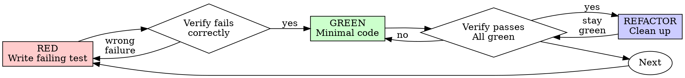

# Relay Test-Driven Development

## Overview

**Core principle:** no production code without a failing test in front of it first. Tests written after the fact prove nothing — they pass immediately, which is not evidence they can catch anything.

**Violating the letter of this process is violating the spirit of it.**

This is a technique, not a relay stage. It carries no artifact file of its own
— see *Scope* below for where its evidence actually gets written.

## When to Use

Use for any new production code written while building a card:
- A new feature or capability the card asks for.
- A bugfix — including the fix that comes out of a `relay-debugging` pass.
- A behaviour change to existing code.
- Refactoring that is supposed to leave behaviour unchanged (the test is what proves it did).

**Use this ESPECIALLY when:**
- A demo or deadline is close and writing the test after "to save a round" feels faster.
- Hours are already sunk into code written without tests, and deleting it feels wasteful.
- The change looks too small to be worth a test.
- "I already ran it by hand and it worked."

**Don't skip when:**
- The codebase already has no tests for the area being touched — that is a reason to add them, not a precedent to extend.
- The card doesn't spell out test cases — the failing test is how the behaviour gets specified, not something written after it is already decided.

## When NOT to Use

- **Nothing is being written yet.** Finding out why something is broken is `relay-debugging`'s job; this skill starts once that root cause is known and a fix is about to be coded.
- **The work is a throwaway prototype, generated code, or a pure configuration file** with no behaviour of its own to test. Flag the exception in whichever record Scope below names, rather than deciding silently that "this one doesn't count."

## Scope: A Technique, Called From Inside a Build Stage

`relay-test-driven-development` is invoked from inside `relay-executing-plans`
or `relay-subagent-driven-development` while a card is being built. It is not
a numbered stage, it has no request-folder artifact of its own, and it never
opens a new file to record itself in.

What this skill produces — which test was written first, what it looked like
failing, what made it pass — is evidence for whichever record the calling
stage already keeps:

- Under `relay-executing-plans`: the card's entry in `06-implementation-log.md`,
  under **Verification run** — the command and what it printed, per that
  stage's own **Evidence Is Written Down, Not Just Produced** rule. "Tests
  pass" is not a substitute for the RED and GREEN output this skill produces.
- Under `relay-subagent-driven-development`: the fix report an implementer
  appends to on every round, and the task reviewer's **Spec Compliance**
  check, which reads that report to confirm a failing test existed before the
  fix.

**REQUIRED SUB-SKILL:** when the code under test is a fix for a bug found via
`relay-debugging`, that skill's Phase 4 already names this skill for writing
the failing test — the two are companion techniques for the same build stage,
one for "something is broken", one for "new behaviour is needed."

## The Iron Law

```
NO PRODUCTION CODE WITHOUT A FAILING TEST FIRST
```

Code got written before its test exists? Delete it. Start over. Not "keep it
as reference" — reference means it gets adapted while writing the test, which
is tests-after wearing a disguise. Delete means delete, then implement fresh
from the test.

## Red-Green-Refactor



### RED — Write the Failing Test

One minimal test, showing what should happen. Before writing its body, name
the production change that would make it fail — see *Naming the Break*
below; a test nobody can point at a specific broken behaviour for is not
ready to write yet.

Requirements: one behaviour per test, a name that describes that behaviour
(no `test1`, no `and` stitching two checks into one), real code exercised
rather than a mock standing in for it unless the mock is unavoidable.

### Verify RED — Watch It Fail

**Mandatory. Never skipped.** Run it and confirm three things: it fails
(doesn't error), the failure message is the one expected, and it fails
because the behaviour is missing — not because of a typo in the test itself.

A test that passes immediately is testing something that already exists —
fix the test. A test that errors instead of failing needs the error fixed
first, then re-run until it fails for the right reason.

### GREEN — Minimal Code

The simplest code that makes the test pass. No added options, no
configurability the test didn't ask for, no improving code the test doesn't
touch. Over-engineering past what the test demands is exactly as far from
this discipline as skipping the test.

### Verify GREEN — Watch It Pass

**Mandatory.** Run the whole suite, not just the new test: it has to pass,
every other test has to still pass, and the output has to be clean — no
stray errors or warnings riding along with a green exit code.

A failing new test means fix the code. A newly-failing old test gets fixed
now, in this same cycle — it is not a finding for later.

### REFACTOR — Clean Up

Only after green. Remove duplication, improve names, extract helpers — all
while the suite stays green throughout. No new behaviour sneaks in here; a
refactor that changes what the code does was never a refactor.

### Repeat

Next failing test, next slice of behaviour.

## Naming the Break

Before writing a test's body, answer: **what production change would make
this test fail — and is that change a bug or a decision?** A test earns its
place by catching a wrong branch, a missing side effect, a wrong argument, a
boundary case, or a broken contract.

**Derive the expected value independently.** Literals and hand-checked
fixtures, not a value computed by the code under test or its own helpers — an
expectation built that way passes no matter what the code does:

```typescript
// Mirror assertion — the same builder computes both sides, always true
const expected = buildSearchQuery({ tag: 'urgent' });
expect(buildSearchQuery({ tag: 'urgent' })).toBe(expected);

// Hand-derived literal
expect(buildSearchQuery({ tag: 'urgent' })).toBe('tag:"urgent"');
```

**No change detectors.** A test only intentional decisions can fail — a
constant's exact value, exact message wording, private structure — fires on
every redesign and sleeps through every bug. Test the behaviour the decision
drives: not `expect(MAX_RETRIES).toBe(5)`, but "a failing call is retried 5
times and there is no 6th attempt."

**Behaviour, not text.** Asserting that a file contains an exact line proves
only that the source is the source. Run it against controlled input and
assert the output, the side effect, or the exit code instead.

**Your own boundary, not the framework's.** Test the contract this code makes
at its edges — the route it registers, the query it emits, the payload it
produces — not the framework mechanics underneath (asserting a router invokes
a handler it registered is the framework's own test, not this codebase's).
Constructors, getters, constants, and trivial forwarding earn a test only
when they validate, normalize, default, derive, enforce, or cause a side
effect; otherwise, test the first consumer-visible result that depends on
them.

## Exercising the Real Thing

**A mock earns no assertions of its own.** An assertion that passes when the
mock is present and fails when it's absent says nothing about the component
it stands in for. Assert on real behaviour; if a mock is what's being
checked, unmock it or drop the assertion.

```typescript
// Real behaviour
expect(screen.getByRole('navigation')).toBeInTheDocument();

// Mock existence — proves nothing about the component
expect(screen.getByTestId('sidebar-mock')).toBeInTheDocument();
```

**Mock at the right level.** Learn every side effect of the real method
before replacing it — mock the slow or external operation and keep whatever
the test actually depends on real. Unsure? Run against the real
implementation first and see what actually needs to happen before deciding
what to mock.

```typescript
// The mock swallows the config write that duplicate detection reads
vi.mock('ToolCatalog', () => ({
  discoverAndCacheTools: vi.fn().mockResolvedValue(undefined)
}));

// Mocks only the slow server startup; the config write stays real
vi.mock('MCPServerManager');
```

**Make doubles specific.** When arguments, call counts, or ordering are part
of the contract, assert them — a double that accepts anything verifies
nothing. Give each branch (success, error, malformed) its own fixture or spy.

**Mirror real data completely.** Mock the full structure as it exists in
reality, every documented field, not just the ones the test reads. A partial
mock fails silently the moment downstream code reads a field the mock never
had — the test stays green while the real integration breaks.

**Production classes carry production methods only.** Cleanup that only
tests need lives in a test utility, never as a `destroy()` bolted onto a
production class. If a method is called only from test files, or if the
class doesn't actually own the resource's lifecycle, it belongs in the test
utility instead.

**Prefer real components over ballooning mocks.** When mock setup outgrows
the test's own logic, when the mock is missing methods the real component
has, or when tests break every time the mock changes, switch to an
integration test with real components instead.

## The Mutation Check

Before calling a test file finished, mentally mutate the production code — at
least one test should fail for each realistic mutation:

- Wrong constant or argument
- Wrong branch handler
- Missing state change or side effect
- Empty or default return where a real value was expected
- Missing validation for zero, empty, nil, unauthorized, or malformed input

A mutation nothing catches means the behaviour is unprotected, or the test
that should have caught it is a change detector in disguise.

## Rationalization Table

| Excuse | Reality |
|---|---|
| "Too simple to test" | Simple code breaks too. The test costs thirty seconds; the untested regression costs a card. |
| "I'll test after" | A test written after the code passes immediately — proof of nothing. It tests the cases remembered while writing the code, not the ones a failing-first test would have forced into the open. |
| "Tests after achieve the same goal, spirit not ritual" | Tests-first answer "what should this do"; tests-after answer "what did I just write" — biased by the code already sitting there. |
| "Already manually tested" | Manual testing leaves no record of what was covered and no way to re-run it. "Worked when I tried it" is not evidence, it's a memory. |
| "Already spent hours on this, deleting is wasteful" | Sunk cost — that time is spent either way. The choice left is rewrite with a failing test first, or keep code nobody has proven catches its own bugs. |
| "Keep it as reference while writing the test" | It gets adapted while the test is written. That's tests-after with extra steps. Delete means delete. |
| "Need to explore the approach first" | Fine — throw the exploration away, then start clean with the failing test. |
| "This is hard to test" | Listen to that. Hard to test usually means hard to use — the design is what needs to change, not the test. |
| "TDD will slow this down" | Debugging an untested regression later is slower than writing the test now. |
| "Manual test is faster" | Manual testing doesn't prove edge cases and has to be redone by hand on every later change. |
| "The existing code around this has no tests either" | This card is improving it — add the test for what's being touched, not an excuse to extend the gap. |
| "I'll add the test right after confirming the fix works" | An unproven fix that "looks fixed" is not the same as a fix a failing test just watched turn green. |
| "Changing a few things at once, then writing one test for all of it" | Nothing isolates which change did what. A second defect hides behind the first fix. |

## Red Flags

Any of these means stop and start the cycle over from RED:

- Code written before its test.
- A test written after the implementation it's supposed to test.
- A test that passes on its first run, never watched fail.
- Not being able to say why the test failed the way it did.
- "I'll add tests later."
- "Just this once."
- "I already tested it by hand."
- "Tests after serve the same purpose — it's about spirit, not ritual."
- "Keep it as reference" or "adapt what's already there."
- "Already spent this many hours on it, deleting is wasteful."
- "This case is different because…"
- A mock assertion where the thing under test is the mock, not the code.

**All of these mean: delete the code, start over with a failing test.**

## Quick Reference

| Phase | Key activities | Done when |
|---|---|---|
| RED | Write one minimal test, name the production change it would catch | Test exists, hasn't been run yet |
| Verify RED | Run it | Fails, for the expected reason, not a typo |
| GREEN | Write the simplest code that satisfies the test | Test passes, no added scope |
| Verify GREEN | Run the whole suite | New test passes, nothing else broke, output is clean |
| REFACTOR | Remove duplication, rename, extract | Suite still green, no behaviour changed |
| Before finishing | Mutation check | At least one test fails per realistic mutation |

Can't check every box above? The cycle was skipped somewhere — go back to RED.
